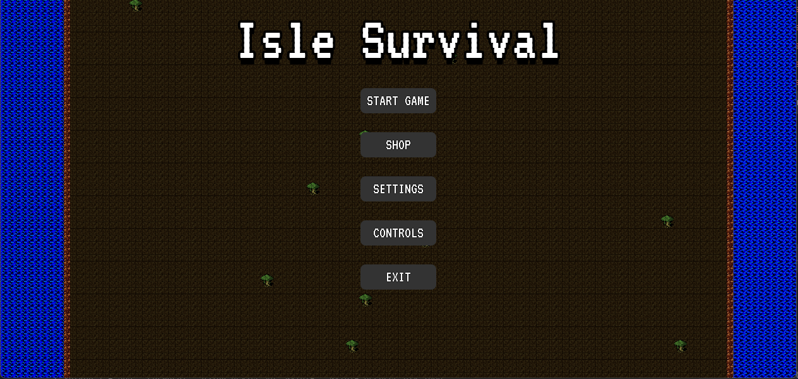
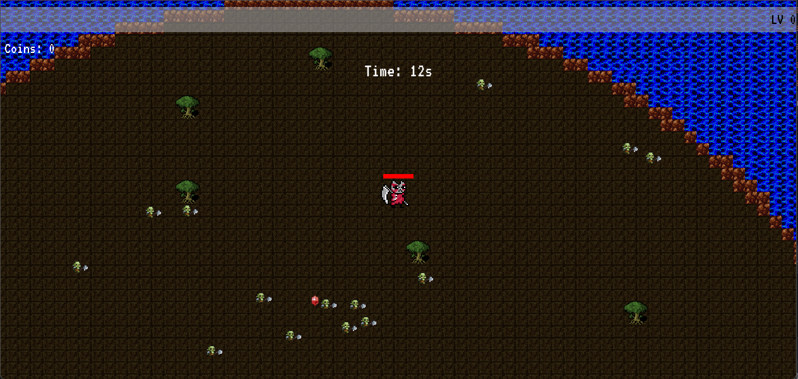
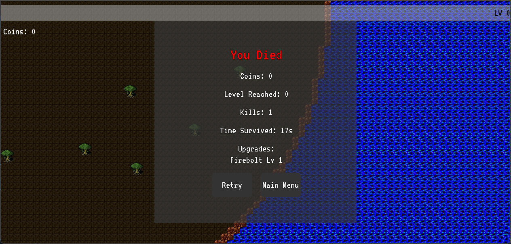
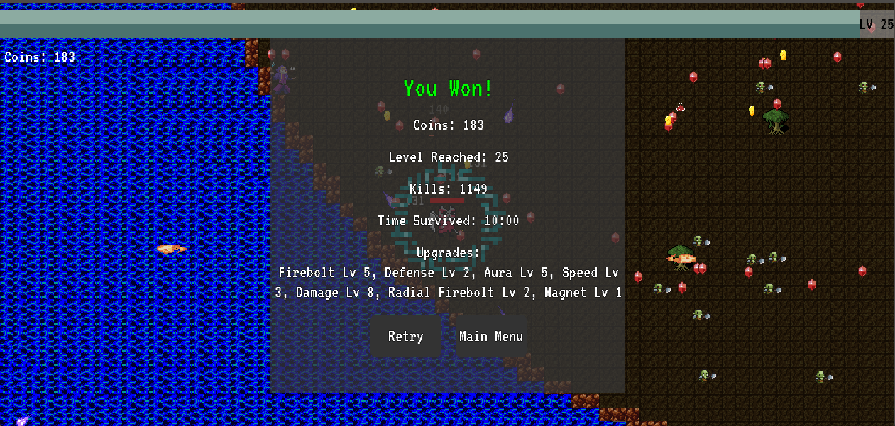

# Isle Survival

Projeto desenvolvido no âmbito da unidade curricular de Projeto da Universidade da Beira Interior (2025).

---

## Como abrir o projeto no Godot 4

1. Faça download do repositório:
   - Clique em "Code" > "Download ZIP" e extraia a pasta, **ou**
   - Utilize o git:
     ```bash
     git clone https://github.com/teu-utilizador/isle-survival.git
     ```

2. Abra o Godot 4 ([https://godotengine.org/download](https://godotengine.org/download)).

3. No menu inicial do Godot, selecione **"Importar Projeto"**.

4. Navegue até à pasta onde extraiu o projeto e selecione o ficheiro `project.godot`.

5. Clique em **"Importar e Editar"**.

6. O projeto ficará imediatamente disponível para consulta e execução, incluindo todos os scripts, cenas e recursos utilizados.

---

## Como jogar o jogo (sem instalar o Godot)

1. Aceda à secção [**Releases**](https://github.com/teu-utilizador/isle-survival/releases) deste repositório.
2. Faça download do ficheiro **.zip** correspondente à versão mais recente do jogo.
3. Extraia o ficheiro (caso tenha descarregado um `.zip`).
4. Execute o ficheiro `IsleSurvivor.exe` (ou equivalente) incluído na release.
5. O jogo será iniciado automaticamente e estará pronto a jogar, sem necessidade de instalar o Godot ou quaisquer dependências adicionais.

> **Nota:**  
> Caso surja um alerta de segurança no Windows, selecione “Mais informações” e depois “Executar mesmo assim”.  
> Certifique-se de que todos os ficheiros extraídos se encontram na mesma pasta do executável.

---

## **Requisitos**

- **Godot 4.x** (o projeto foi desenvolvido e testado na versão 4.4.X)
- Não necessita de dependências externas.

---

## **Screenshots**

  
  
  
  

---

> **Nota:** Este repositório permanecerá inalterado após a entrega. Melhorias futuras poderão ser disponibilizadas em [https://github.com/S-Sphere/ProjectGameGodot](https://github.com/S-Sphere/ProjectGameGodot).


